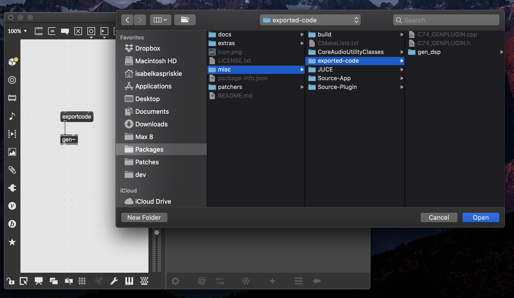

# `gen~` Plugin Export

This is an example project that should help you get started with building your
own VST3 plugins and iOS applications with the help of the code-export feature
of `gen~`, part of [Max 8](https://cycling74.com/max7/) made by
[Cycling '74](https://cycling74.com/).

It is based on the JUCE Framework. Please be aware that the JUCE has its own
license terms (mostly GPL with the availability of commercial licenses). See
their [website](http://www.juce.com/) for further details.

## CMake

As of v2.1.0 (`f2de092ea`), `gen-plugin-export` uses CMake to build plugins.
If you are experiencing issues with CMake and would like to try using the
Projucer, you can check out a previous version of this project and use it
instead (e.g. `git checkout v2.0.4`).

## Prerequisites

- Download and install [CMake](https://cmake.org/download/). Version 3.18 or
  higher is required. Make sure you add it to your path.[^1]
- (MacOS) Download and install
  [Xcode](https://developer.apple.com/xcode/resources/). We have tested using
  Xcode 12.
- (Windows) Download and install [Visual Studio 2019](https://visualstudio.microsoft.com/vs/).
  Community Edition is enough!

## How to use

Everything you need to build a plugin is outlined in `GenPluginExport.maxpat`.

In short here are the steps:
1. Begin with a `gen~` patcher. ***Important! In the inspector, change the export name
   attribute to `C74_GENPLUGIN`.***

2. Export the C++ code from `gen~` using the `codeexport` message. Export to
the `misc/exported-code` directory of this package. You should eventually see 
   - `misc/exported-code/gen_dsp/`
   - `misc/exported-code/C74_GENPLUGIN.cpp`
   - `misc/exported-code/C74_GENPLUGIN.h`

3. Open a Terminal (MacOS) or PowerShell (Windows) window. Navigate to the
   `gen~ Plugin Export` (or `gen-plugin-export`) directory using `cd`.[^2] (See
   footnote for help if you're new to using the terminal.)

> Note: Working with CMake involves two steps --- "generating" a project, and
   "building" the project. This is because CMake takes care of OS specific
   things (like figuring out where your C++ compiler is and creating any IDE
   projects you would like to work in, and so on). For building a simple
   plugin, you don't need to be a CMake expert.[^3]

4. To generate, do one of the following:

| Option                            | Command                                               |
|-----------------------------------|-------------------------------------------------------|
| MacOS (Xcode project generator)   | `cmake -G "Xcode" -S misc -B misc/build`              |
| MacOS (Makefile generator)        | `cmake -G "Unix Makefiles" -S misc -B misc/build"`    |
| MacOS (Ninja generator)           | `cmake -G "Ninja" -S misc -B misc/build"`             |
| Windows (Visual Studio generator) | `cmake -G "Visual Studio 16 2019" -S misc -B misc/build` |

If you're unsure of what option to use, `Xcode` and `Visual Studio` are
probably the ones to pick from. If you're on Windows using a Visual Studio
version other than 2019, you'll need to substitute the proper string for the
`-G` option. You can find it by running `cmake --help` and using the
appropriate string for your Visual Studio version.

5. Now you can build with `cmake --build misc/build --config Release`.

## File structure

Most of the code is located within the `misc/` directory. So that the launch
patcher is available from the `Extras` dropdown in Max, it lives in the
`extras/` directory.

Some notable files/directories:

| Location                      | Explanation                                                         |
|-------------------------------|---------------------------------------------------------------------|
| extras/GenPluginExport.maxpat | main Max patcher to automate building plugins                       |
| misc/exported-code/           | the folder where gen~ will export C++ code                          |
| misc/CoreAudioUtilityClasses/ | required for building Audio Units                                   |
| misc/Source-App/              | Source for iOS Application - feel free to edit (includes sample UI) |
| misc/Source-Plugin/           | Source for Audio Plugins - feel free to edit                        |
| misc/JUCE/                    | The JUCE framework - do not edit these                              |

### Build locations
| Location                | Explanation         |
|-------------------------|---------------------|
| misc/build/App-Builds/  | iOS projects        |
| misc/build/AU-Builds/   | AudioIUnit projects |
| misc/build/VST3-Builds/ | VST3 projects       |

## Customization

Plugin building is based on the [JUCE Framework](http://www.juce.com/). Please
refer to tutorials from JUCE on building UIs, for instance.

Enjoy!

[^1]: To check that CMake is on your path, you can run the command `cmake
--version`. If you see a version number, all is well. If not, Google how to
make sure CMake is found on your path for your OS.
[^2]: If you're new to navigating the terminal, learn about how to use the `cd`
  command
  [here](https://www.macworld.com/article/221277/command-line-navigating-files-folders-mac-terminal.html)
  or [here for Windows](https://www.youtube.com/watch?v=AL1eRvsYniM).
[^3]: It's a useful tool to become familiar with, though, so check out the
  [documentation](https://cmake.org) if you want to get up to speed. 
